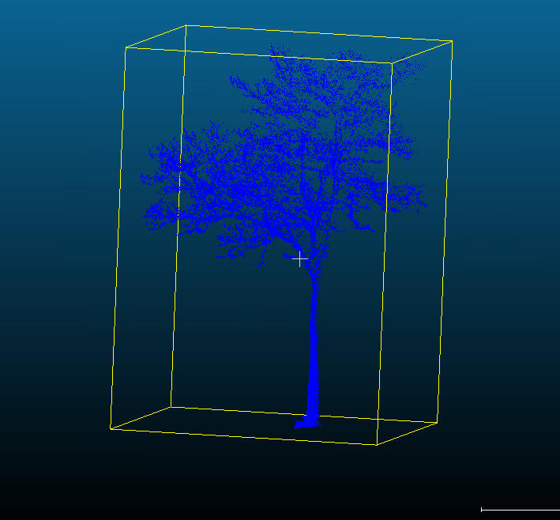
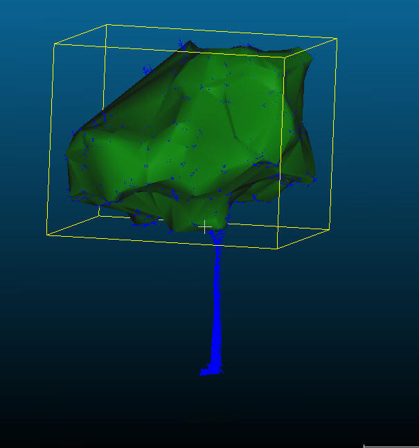
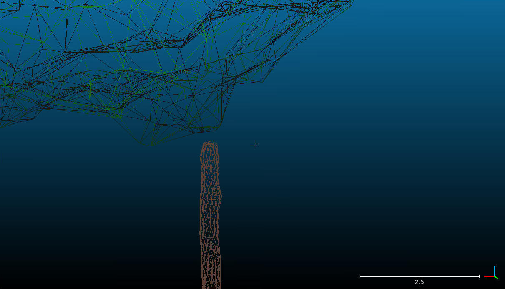

# 🌳 tree_modeling — Tree Geometry Reconstruction & Metrics
[](https://github.com/Municipality-of-Rotterdam/tree_modeling/actions/workflows/main.yml)

`tree_modeling` is a Python package for **reconstructing 3D tree geometries** and computing **tree- and streetscape-level metrics** from segmented point clouds.  
It consumes preprocessed per-tile outputs (from [`pc_ops`](https://github.com/Municipality-of-Rotterdam/pc_ops)), then:

- **Separates stem and crown** (via AdTree skeletons + curated slice filtering),
- **Builds meshes** (crown α-shape / convex hull, stem cylinders),
- **Computes metrics** (crown size/volume/shape, DBH, stem angle, stem/crown height),
- **Detects tree–pavement interactions** (2D/3D overhangs of tree crowns over pavements),
- **Writes per-tree artifacts** and **tile-level summaries** (JSON + GeoPackage).

| Tree pointcloud | Crown mesh | Crown + stem mesh |
|:---------------:|:----------:|:-----------------:|
|  |  |  |

*Outputs include crown and stem meshes, per-tree stats, and per-tile summaries with pavement overlap tags.*

---

## 📘 Overview

The toolkit supports:

* **Stem–crown separation** — Uses **AdTree** skeleton reconstruction to derive a stem path, then classifies points into stem vs crown; optional **leaf/wood filtering** improves robustness.

* **Slice-based curation** — Validity checks over horizontal height slices prune noise for both stem and crown; remaining invalid stem points can optionally be mined to **recover crown fragments** (connected components + distance heuristics).

* **Geometry reconstruction** — **Crown α-shape** (or convex hull) mesh with volume; **stem cylinders** (per-slice cylinder fitting and meshing) + **DBH** from a local vertical fit.

* **Metrics** — Crown center/size/base/top heights, lowest crown points per quadrant, shape (conical/inverse/spherical/cylindrical), volume; stem height, DBH, angle/bearing.

* **Pavement interaction analysis** — Builds free-pavement zones and finds **2D/3D overhangs**; writes a per-tile GeoPackage with merged metrics and overhang attributes.

---

## 🔗 Upstream Context

`tree_modeling` assumes you’ve already run:
- `pkg_pc_prep` (tiling/raster/prompt prep),
- `pkg_pc_segment` (2D segmentation → masks),
- `pkg_pc_ops` (3D conversion, tree extraction).

It then consumes **pc_ops metadata** and **BGT pavements metadata** to model trees per tile.

---

## 📂 Required Inputs

Provide the **metadata JSONs** produced upstream:

| Input                           | Format | Description |
|---------------------------------|--------|-------------|
| **PC Ops metadata** (`--ops_metadata`) | `.json` | Maps tile → ops artifacts (incl. `tile_path`, `tree_segments_path`, `tree_file_paths`). |
| **BGT pavements metadata** (`--bgt_metadata`) | `.json` | Maps tile → per-tile BGT pavements source path(s). |
| **PC Ops root** (`--ops_dir`)  | dir    | Base path where all pc_ops artifacts are stored. |
| **BGT root** (`--bgt_dir`)     | dir    | Base path for per-tile BGT pavements files. |
| **Modeling output root** (`--modeling_dir`) | dir | Destination for per-tree and per-tile modeling outputs. |

> The AdTree executable is resolved internally via `Paths.get_adtree()`.

---

## ⚙️ Installation

Create the environment from the repo root:

```bash
conda env create -f environment.yml
conda activate tree_modeling
[pip install poetry &&] poetry install
```

This package integrates:
- **AdTree** (skeleton reconstruction)
- Open3D, NumPy, SciPy, scikit-learn, GeoPandas, Shapely, NetworkX, Trimesh, PyMeshFix, laspy, tqdm.

### Installing AdTree

A modified version of the [Adtree](https://github.com/tudelft3d/AdTree) repo is added in the 'AdTree' folder.

Make sure the requirements for AdTree are installed by running

```bash
sudo apt-get install libboost-all-dev libglfw3-dev libgl1-mesa-dev libglu1-mesa-dev
```

After that, compile AdTree by navigating to the AdTree dir and running

```bash
cmake -DCMAKE_BUILD_TYPE=Release .
make
```

Verify that the executable is available to `Paths.get_adtree()`:

```python
from tree_modeling.config import Paths
Paths.get_adtree()
```

---

## 🚀 Usage Guide

### 🧠 Modeling Pipeline (`tree_modeling.modeling_tree`)

This script processes **all tiles/trees** from your metadata and runs modeling in parallel.

#### What it does per tree

1. **Load inputs** for the tile (ground LAS subset, tree segment point cloud).
2. **Separate stem and crown** with AdTree skeleton + curated slice filters.
3. **Recover crown** from leftover points (optional, via connected components near crown).
4. **Mesh & metrics**:
   - Crown α-shape mesh + volume and shape classification,
   - Stem cylinders mesh, **DBH**, **angle**, **bearing**, **height**,
   - Crown–stem center offset; lowest crown points by quadrant,
   - Reference pavement height (median/min/max).
5. **Persist artifacts**:
   - `stem_curate.ply`, `stem_mesh.ply`, `crown_curate.ply`, `crown_mesh.ply`,
   - `breast_mesh.ply` (if DBH slice fit succeeds),
   - Per-tree `tree_stats.json`.
6. **Per-tile aggregation**:
   - Combine all per-tree stats → `tree_stats_combined.json`,
   - Create **free pavement zones** and compute **overhangs** → `pavement_tree_intersections.json`,
   - Write **GeoPackage** with merged tree metrics + segment polygons + overhang tags → `tree_stats_segments.gpkg`.

#### CLI

Run as a module:

```bash
python -m tree_modeling.modeling_tree   --ops_metadata /data/pc_ops/ops_metadata.json   --bgt_metadata /data/bgt/bgt_metadata.json   --ops_dir /data/pc_ops   --bgt_dir /data/bgt   --modeling_dir /data/tree_modeling   --num_workers 8   --overwrite false   --debug false
```

#### Arguments

- `--ops_metadata` (`str`) — Path to PC ops metadata JSON.
- `--bgt_metadata` (`str`) — Path to BGT pavements metadata JSON.
- `--ops_dir` (`str`) — Root directory for PC ops artifacts.
- `--bgt_dir` (`str`) — Root directory for BGT pavements files.
- `--modeling_dir` (`str`) — Root directory for modeling outputs.
- `--num_workers` (`int`) — Parallel workers; defaults to `CPU - 1`. Out-of-range values fall back safely.
- `--overwrite` (`true`/`false`) — Recompute if per-tree JSON exists.
- `--debug` (`true`/`false`) — Write additional debug figures (slice plots, overlays, etc.).

---

## 📤 Outputs

Per **tree** (under `--modeling_dir/<tile>/<obsurv_id>/`):

- `stem_curate.ply`, `crown_curate.ply` — curated point clouds,
- `stem_mesh.ply`, `crown_mesh.ply` — meshes,
- `breast_mesh.ply` — DBH slice cylinder (when available),
- `tree_stats.json` — all computed metrics, IDs, file refs, stem–segment distance.

Per **tile** (under `--modeling_dir/<tile>/`):

- `tree_stats_combined.json` — combined tree stats (per-tree JSONs merged),
- `pavement_tree_intersections.json` — per-pavement 2D/3D overlap lists,
- `tree_stats_segments.gpkg` — segment polygons + merged metrics + `overhangs_pavement` attribute.

Top-level:

- `--modeling_dir/tree_modeling_results.json` — map of each tile dir → artifact paths:
  ```json
  {
    "filtered_1846_8712": {
      "tree_stats_json": "/data/tree_modeling/filtered_1846_8712/tree_stats_combined.json",
      "tree_stats_gpkg": "/data/tree_modeling/filtered_1846_8712/tree_stats_segments.gpkg"
    },
    "...": { "...": "..." }
  }
  ```

---

## 🧪 Debug Visuals

- **Slice QA** — `*_slices.png` and `*_filter.png` for crown/stem curation.
- **Separation QA** — `stem_crown_separation.png` (colored combined cloud).
- **Mesh QA** — `stem_crown_mesh.png` (both meshes overlayed).
- **Base fit QA** — `stem_base.png` (cylinder, rays, ground intersections).

---

## 📑 Data Structures (selected)

Per-tree `tree_stats.json` includes (non-exhaustive):

- `obsurv_id`, `pc_filename`, `segment_id`, `stem_obsurv_distance`,
- `crown_center`, `crown_basepoint`, `crown_toppoint`, `crown_lowest_points`,
- `crown_size`, `crown_base_height`, `crown_top_height`, `crown_diameter`, `crown_shape`, `crown_volume`,
- `stem_height`, `diameter_at_breast_height`, `stem_CCI (med, min, max)`, `stem_angle`, `compas_bearing`,
- `stem_basepoint`, `stem_cyl_axis`, `stem_crown_dist`,
- `ref_pavement_height (med, min, max)`.

`tree_stats_segments.gpkg` adds:
- each matched segment polygon,
- merged metrics + `overhangs_pavement` listing intersected free pavement zones (2D/3D as configured).

---

## 🧠 Developer Notes

- Coordinate system expected: **EPSG:28992 (Amersfoort / RD New)** (consistent with upstream).
- AdTree skeleton path is resolved via project `Paths.get_adtree()`.

---

## 🧾 License

This project is distributed under the **EUPL License**.  
See [LICENSE](./LICENSE) for details.

---

## 📚 Citation & Acknowledgements

This package builds upon concepts and components from:

- [AdTree](https://github.com/tudelft3d/AdTree) — tree skeleton reconstruction.
- Amsterdam Intelligence [PointCloud_Tree_Modelling](https://github.com/Amsterdam-AI-Team/PointCloud_Tree_Modelling) for foundational methods and ideas.

---

## 👥 Authors & Contact

Developed by the **City of Rotterdam** for automated tree modeling and urban LiDAR analytics.
